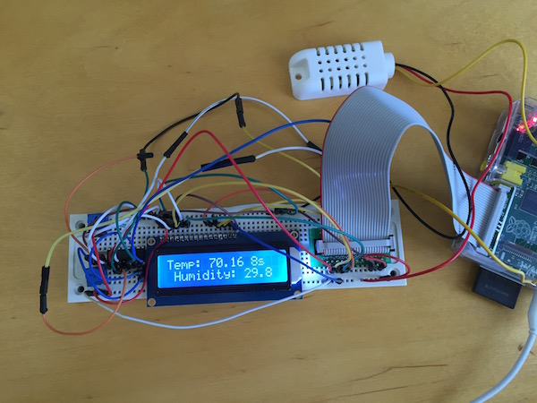

#dht.swift

*A Swift library for DHTXX temperature & humidity sensors*

 

#Summary

A Swift library for reading temperature and humidity from DHTXX sensors (DHT11, DHT22, AM2303).

## Supported Boards

Every board supported by [SwiftyGPIO](https://github.com/uraimo/SwiftyGPIO): Raspberries, BeagleBones, C.H.I.P., etc...

The example below will use a RaspberryPiRev2 board but you can easily modify the example to use one the the other supported boards.
 
## Installation

To use this library, you'll need a Linux ARM board with Swift 2.2.

Please refer to the [SwiftyGPIO](https://github.com/uraimo/SwiftyGPIO) readme for Swift installation instructions.

Once your board runs Swift, considering that at the moment the package manager is not available on ARM, you'll need to manually download the library and its dependencies.  However, I have created a Makefile that does the wget magic for you.  Simply clone this repo, and run `make`

The compiler will create a **dhttest** executable.

As everything interacting with GPIOs via sysfs, if you are not already root, you will need to run that binary with `sudo ./dhttest`.

## Usage 

In the following usage example i'll use a 20x2 LCD connected to a RaspberryPiRev2 with a AM2303 sensor.

Details are in my blog post, but you should be able to run `dhttest` and the application will update the screen with the temp/humidity, when it can.

## TODO

- [ ] Not real-time, but maybe nothing to be done?
- [ ] Don't like the for-loop for sampling, would be nice to have callbacks
- [ ] No support for DHT11 yet, should make enum and know the different types
